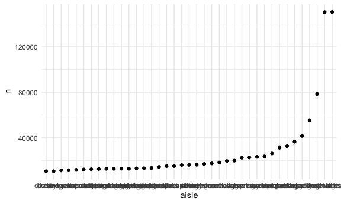
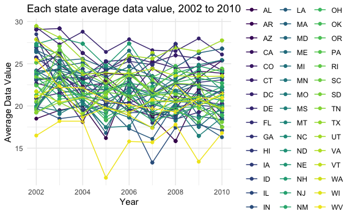
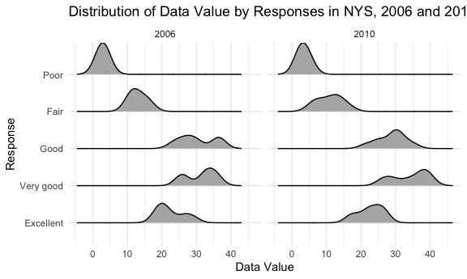
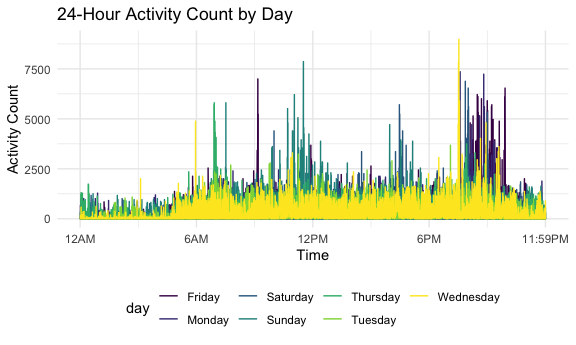

p8105\_hw3\_jf3354
================
Judy Fordjuoh
October 15, 2021

\#Loading all the librarys/setting the themes,color schemes, and the
graph output sizes

``` r
library(tidyverse)
```

    ## ── Attaching packages ─────────────────────────────────────── tidyverse 1.3.1 ──

    ## ✓ ggplot2 3.3.5     ✓ purrr   0.3.4
    ## ✓ tibble  3.1.4     ✓ dplyr   1.0.7
    ## ✓ tidyr   1.1.3     ✓ stringr 1.4.0
    ## ✓ readr   2.0.1     ✓ forcats 0.5.1

    ## ── Conflicts ────────────────────────────────────────── tidyverse_conflicts() ──
    ## x dplyr::filter() masks stats::filter()
    ## x dplyr::lag()    masks stats::lag()

``` r
library(dplyr)
library(ggplot2)
library(ggridges)
library(patchwork)
library(p8105.datasets)
knitr::opts_chunk$set(
  fig.width = 6,
  fig.asp = .6,
  out.width = "90%"
)
theme_set(theme_minimal() + theme(legend.position = "bottom"))
options(
  ggplot2.continuous.colour = "viridis",
  ggplot2.continuous.fill = "viridis"
)
scale_colour_discrete = scale_color_viridis_d
scale_fill_discrete = scale_fill_viridis_d
```

**QUESTION 1**

``` r
data("instacart") #looking at the dataset as a whole. 15 columns and 1,384,617 rows
instacart %>%
  count(aisle) %>%
  arrange(desc(n))
```

    ## # A tibble: 134 × 2
    ##    aisle                              n
    ##    <chr>                          <int>
    ##  1 fresh vegetables              150609
    ##  2 fresh fruits                  150473
    ##  3 packaged vegetables fruits     78493
    ##  4 yogurt                         55240
    ##  5 packaged cheese                41699
    ##  6 water seltzer sparkling water  36617
    ##  7 milk                           32644
    ##  8 chips pretzels                 31269
    ##  9 soy lactosefree                26240
    ## 10 bread                          23635
    ## # … with 124 more rows

``` r
summary(instacart)
```

    ##     order_id         product_id    add_to_cart_order   reordered     
    ##  Min.   :      1   Min.   :    1   Min.   : 1.000    Min.   :0.0000  
    ##  1st Qu.: 843370   1st Qu.:13380   1st Qu.: 3.000    1st Qu.:0.0000  
    ##  Median :1701880   Median :25298   Median : 7.000    Median :1.0000  
    ##  Mean   :1706298   Mean   :25556   Mean   : 8.758    Mean   :0.5986  
    ##  3rd Qu.:2568023   3rd Qu.:37940   3rd Qu.:12.000    3rd Qu.:1.0000  
    ##  Max.   :3421070   Max.   :49688   Max.   :80.000    Max.   :1.0000  
    ##     user_id         eval_set          order_number      order_dow    
    ##  Min.   :     1   Length:1384617     Min.   :  4.00   Min.   :0.000  
    ##  1st Qu.: 51732   Class :character   1st Qu.:  6.00   1st Qu.:1.000  
    ##  Median :102933   Mode  :character   Median : 11.00   Median :3.000  
    ##  Mean   :103113                      Mean   : 17.09   Mean   :2.701  
    ##  3rd Qu.:154959                      3rd Qu.: 21.00   3rd Qu.:5.000  
    ##  Max.   :206209                      Max.   :100.00   Max.   :6.000  
    ##  order_hour_of_day days_since_prior_order product_name          aisle_id    
    ##  Min.   : 0.00     Min.   : 0.00          Length:1384617     Min.   :  1.0  
    ##  1st Qu.:10.00     1st Qu.: 7.00          Class :character   1st Qu.: 31.0  
    ##  Median :14.00     Median :15.00          Mode  :character   Median : 83.0  
    ##  Mean   :13.58     Mean   :17.07                             Mean   : 71.3  
    ##  3rd Qu.:17.00     3rd Qu.:30.00                             3rd Qu.:107.0  
    ##  Max.   :23.00     Max.   :30.00                             Max.   :134.0  
    ##  department_id      aisle            department       
    ##  Min.   : 1.00   Length:1384617     Length:1384617    
    ##  1st Qu.: 4.00   Class :character   Class :character  
    ##  Median : 8.00   Mode  :character   Mode  :character  
    ##  Mean   : 9.84                                        
    ##  3rd Qu.:16.00                                        
    ##  Max.   :21.00

**Answer: In the instacart data there are 15 columns and 1,384,617 rows.
Some variables included the aisle, aisle ID, product id, order numbers,
user id, and day of the week which only included 6 days. The data is
organized by the order number. There are 134 aisles. The fresh
vegetables aisle(n=150609) and fresh fruits aisle (n= 150473) are the
aisles where the most items are ordered from, respectively.**

``` r
instacart %>% 
  count(aisle) %>% 
  filter(n > 10000) %>% 
  mutate(
    aisle = factor(aisle),
    aisle = fct_reorder(aisle, n)
  ) %>% 
  ggplot(aes(x = aisle, y = n)) +
  geom_point() +
theme(axis.text.x = element_text(angle = 90, vjust = 0.5, hjust = 1)) +
  labs(
    title = "Number of items ordered in each aisle",
    x = "Aisle Name",
    y = "Number of items"
  ) 
```



``` r
#Make a table showing the three most popular items in each of the aisles “baking ingredients”, “dog food care”, and “packaged vegetables fruits”. Include the number of times each item is ordered in your table.

#Note to self: %in% checks whether or not the object is contained in the other object.  == is a logical operator that checks for identity properties.

instacart %>%
  filter(aisle %in% c("baking ingredients", "dog food care", "packaged vegetables fruits")) %>% 
  group_by(aisle) %>%
  count(product_name) %>%
  mutate(ranking = min_rank(desc(n))) %>%  #ranking the n so that those with the least ranking go to the bottom
  filter(ranking < 4) %>% #so we can get only the the top 3 rankings
  arrange(aisle, ranking) %>%
  knitr::kable()
```

| aisle                      | product\_name                                 |    n | ranking |
|:---------------------------|:----------------------------------------------|-----:|--------:|
| baking ingredients         | Light Brown Sugar                             |  499 |       1 |
| baking ingredients         | Pure Baking Soda                              |  387 |       2 |
| baking ingredients         | Cane Sugar                                    |  336 |       3 |
| dog food care              | Snack Sticks Chicken & Rice Recipe Dog Treats |   30 |       1 |
| dog food care              | Organix Chicken & Brown Rice Recipe           |   28 |       2 |
| dog food care              | Small Dog Biscuits                            |   26 |       3 |
| packaged vegetables fruits | Organic Baby Spinach                          | 9784 |       1 |
| packaged vegetables fruits | Organic Raspberries                           | 5546 |       2 |
| packaged vegetables fruits | Organic Blueberries                           | 4966 |       3 |

**Answer: In the baking ingredients aisle, Light Brown Sugar (n=499),
Pure Baking Soda (n=387), and Cane Sugar (n=336), are the 3 most popular
items. In the dog food care aisle, Snack Sticks Chicken & Rice Recipe
Dog Treats (n=30), Organix Chicken & Brown Rice Recipe (n=28), and Small
Dog Biscuits (n=26), are the 3 most popular items. In the packaged
vegetables and fruits aisle, Organic Baby Spinach (n=9784), Organic
Raspberries (n=5546), and Organic Blueberries (n=4966), are the 3 most
popular items.**

``` r
#Make a table showing the mean hour of the day at which Pink Lady Apples and Coffee Ice Cream are ordered on each day of the week; format this table for human readers (i.e. produce a 2 x 7 table).

instacart %>% 
  filter(product_name %in% c("Pink Lady Apples", "Coffee Ice Cream")) %>% 
  group_by(product_name, order_dow) %>% 
  summarise(mean_hour = mean(order_hour_of_day)) %>% 
  mutate(order_dow = recode(order_dow,
                            "0" = "Sunday",
                            "1" = "Monday",
                            "2" = "Tuesday",
                            "3" = "Wedensday",
                            "4" = "Thursday",
                            "5" = "Friday",
                            "6" = "Saturday")) %>% 
  pivot_wider(
    names_from = order_dow,
    values_from = mean_hour
  ) %>%
 knitr::kable()
```

    ## `summarise()` has grouped output by 'product_name'. You can override using the `.groups` argument.

| product\_name    |   Sunday |   Monday |  Tuesday | Wedensday | Thursday |   Friday | Saturday |
|:-----------------|---------:|---------:|---------:|----------:|---------:|---------:|---------:|
| Coffee Ice Cream | 13.77419 | 14.31579 | 15.38095 |  15.31818 | 15.21739 | 12.26316 | 13.83333 |
| Pink Lady Apples | 13.44118 | 11.36000 | 11.70213 |  14.25000 | 11.55172 | 12.78431 | 11.93750 |

**QUESTION 2**

``` r
#Note to self: You can change the order level of a factor variable to your specified preference using forcats::fct_relevel (visualization pt 2)

#cleaning the data 
brfss <- brfss_smart2010 %>% 
  janitor::clean_names() %>%
  filter(topic == "Overall Health") %>%
  filter(response %in% c("Excellent", "Very good", "Good", "Fair", "Poor")) %>% #include only responses from “Excellent” to “Poor”
  mutate(response = forcats::fct_relevel(response, c("Excellent", "Very good", "Good", "Fair", "Poor"))) #organizing the responses as a factor taking levels ordered from “Excellent” to “Poor”
```

``` r
#Note to self: n_distinct efficiently count the number of unique values in a set of vector. Lecture:exploratory analysis.

#In 2002, which states were observed at 7 or more locations? What about in 2010?
brfss %>% 
  filter(year %in% c("2002", "2010")) %>% 
  group_by(year, locationabbr) %>% 
  summarise(location = n_distinct(locationdesc)) %>% #counting the number of times the location is listed in locationdesc then I'll filtering to only those who were in 7 or more locations
  filter(location >= 7)
```

    ## `summarise()` has grouped output by 'year'. You can override using the `.groups` argument.

    ## # A tibble: 20 × 3
    ## # Groups:   year [2]
    ##     year locationabbr location
    ##    <int> <chr>           <int>
    ##  1  2002 CT                  7
    ##  2  2002 FL                  7
    ##  3  2002 MA                  8
    ##  4  2002 NC                  7
    ##  5  2002 NJ                  8
    ##  6  2002 PA                 10
    ##  7  2010 CA                 12
    ##  8  2010 CO                  7
    ##  9  2010 FL                 41
    ## 10  2010 MA                  9
    ## 11  2010 MD                 12
    ## 12  2010 NC                 12
    ## 13  2010 NE                 10
    ## 14  2010 NJ                 19
    ## 15  2010 NY                  9
    ## 16  2010 OH                  8
    ## 17  2010 PA                  7
    ## 18  2010 SC                  7
    ## 19  2010 TX                 16
    ## 20  2010 WA                 10

**Answer: In 2002, CT, FL, and NC, were the three states that were
observed at 7 locations. MA and NJ were observed at 8 locations while PA
was observed at 10 locations. In 2010, CO, PA and SC were observed at 7
locations, OH was observed at 8 locations, NY and MA were observed at 9
locations, WA and NE were observed at 10 locations, CA, MD, and NC were
observed in 12 locations, TX were observed in 16 locations, NJ were
observed in 19 locations, and FL were observed in 41 locations.**

``` r
#Construct a dataset that is limited to Excellent responses, and contains, year, state, and a variable that averages the data_value across locations within a state. Make a “spaghetti” plot of this average value over time within a state 
brfss2 <- brfss %>% 
  rename(state = locationabbr) %>%
  select(year, state, response, data_value) %>%
  filter(response == "Excellent") %>%
  group_by(year,state) %>%
  mutate(average_dv = mean(data_value)) %>%
  ggplot(aes(x = year, y = average_dv, color = state)) +
  geom_point() +
  geom_line() +
  labs(
    title = "Each state average data value, 2002 to 2010",
    x = "Year",
    y = "Average Data Value") +
    theme(legend.position = "right")

brfss2
```

    ## Warning: Removed 71 rows containing missing values (geom_point).

    ## Warning: Removed 65 row(s) containing missing values (geom_path).



**Answer: Due to me trying to plot many states in one plot, it is quite
difficult to tell the difference between each line. However, we can see
that there are quite a few states that have an average data value that
stays within the range of 20 to 25 throughout the years.**

``` r
#Make a two-panel plot showing, for the years 2006, and 2010, distribution of data_value for responses (“Poor” to “Excellent”) among locations in NY State.

brfss3 <- brfss %>% 
  filter(year %in% c("2006","2010") & locationabbr == "NY") %>% 
  ggplot(aes(x = data_value, y = response)) +
  geom_density_ridges(scale = .85) +
  facet_grid(~year) +
  labs(
    title = "Distribution of Data Value by Responses in NYS, 2006 and 2010",
    x = "Data Value",
    y = "Response"
  )

brfss3
```

    ## Picking joint bandwidth of 2.1

    ## Picking joint bandwidth of 2.03



**Answer:I decided to use a density graph because they are good at
showcasing the distribution of a numeric variable in a dataset. In terms
of responses, we see that there was not much of a difference in the data
values between the poor responses in 2006 and 2010. In the fair
responses in 2006, there was a peak in the data value between 10 and 15
(I would say the peak is around 12). However in 2010 we see that the
data value range widens a bit and the peak shifts a tad bit (I would say
the peak is around 13). In 2006, the good responses had a bimodial
distribution with a peak between 25 and 30 and a peak between 35 and 40.
In 2010, the distribution of the data value becomes more unimodial with
a significant peak at data value = 30. In the 2006 very good responses,
we see that the distribution was bimodial with a peak at data value =25
and another peak around data value =34. In 2010, the distribution stays
bimodial with a peak at data value =23 and another peak around data
value =37 or 38. In the excellent response, we see that it follows a
bimodial distribution with a peak at data value =20 and another around
data value =27. In 2010 th shsape becomes more unimodal with a
significant point at 25.**

**QUESTION 3**

``` r
#Describe the resulting dataset (e.g. what variables exist, how many observations, etc).

accel_df = 
  read_csv('accel_data.csv') %>%
  janitor::clean_names() %>%
  pivot_longer(
    activity_1:activity_1440,
    names_to = "minute",
    names_prefix = "activity_",
    values_to = "activity"
  ) %>%
  mutate(day_type = ifelse(day %in% c("Saturday", "Sunday"),"weekend", "weekday"),
         minute = as.integer(minute))
```

    ## Rows: 35 Columns: 1443

    ## ── Column specification ────────────────────────────────────────────────────────
    ## Delimiter: ","
    ## chr    (1): day
    ## dbl (1442): week, day_id, activity.1, activity.2, activity.3, activity.4, ac...

    ## 
    ## ℹ Use `spec()` to retrieve the full column specification for this data.
    ## ℹ Specify the column types or set `show_col_types = FALSE` to quiet this message.

**Answer: This dataset contains 5 weeks of accelerometer data collected
from a 63 year-old male with BMI 25, who was admitted to the Advanced
Cardiac Care Center of Columbia University Medical Center and diagnosed
with congestive heart failure (CHF). There are 50400 rows and 6 columns
in the accel\_df. The variables in this dataframe are week, day\_id,
day, minute, activity, and the day\_type. Day\_type is the variable I
created which specifies if a day is a weekday or weekend.**

``` r
#Using your tidied dataset, aggregate accross minutes to create a total activity variable for each day, and create a table showing these totals. Are any trends apparent?

accel_df %>%
  mutate(
    day = forcats::fct_relevel(day, c("Monday","Tuesday","Wednesday","Thursday","Friday","Saturday","Sunday"))
  ) %>%
  group_by(week, day) %>%
  summarize(
    total_activity = sum(activity)
  ) %>%
  knitr::kable()
```

    ## `summarise()` has grouped output by 'week'. You can override using the `.groups` argument.

| week | day       | total\_activity |
|-----:|:----------|----------------:|
|    1 | Monday    |        78828.07 |
|    1 | Tuesday   |       307094.24 |
|    1 | Wednesday |       340115.01 |
|    1 | Thursday  |       355923.64 |
|    1 | Friday    |       480542.62 |
|    1 | Saturday  |       376254.00 |
|    1 | Sunday    |       631105.00 |
|    2 | Monday    |       295431.00 |
|    2 | Tuesday   |       423245.00 |
|    2 | Wednesday |       440962.00 |
|    2 | Thursday  |       474048.00 |
|    2 | Friday    |       568839.00 |
|    2 | Saturday  |       607175.00 |
|    2 | Sunday    |       422018.00 |
|    3 | Monday    |       685910.00 |
|    3 | Tuesday   |       381507.00 |
|    3 | Wednesday |       468869.00 |
|    3 | Thursday  |       371230.00 |
|    3 | Friday    |       467420.00 |
|    3 | Saturday  |       382928.00 |
|    3 | Sunday    |       467052.00 |
|    4 | Monday    |       409450.00 |
|    4 | Tuesday   |       319568.00 |
|    4 | Wednesday |       434460.00 |
|    4 | Thursday  |       340291.00 |
|    4 | Friday    |       154049.00 |
|    4 | Saturday  |         1440.00 |
|    4 | Sunday    |       260617.00 |
|    5 | Monday    |       389080.00 |
|    5 | Tuesday   |       367824.00 |
|    5 | Wednesday |       445366.00 |
|    5 | Thursday  |       549658.00 |
|    5 | Friday    |       620860.00 |
|    5 | Saturday  |         1440.00 |
|    5 | Sunday    |       138421.00 |

**Answer: Activity counts were at their lowest on the two Saturdays
prior to end of data collection (weeks 4 and 5). This individual is most
active on Friday, Saturday, Sunday, and Monday. However the Saturday of
Week 4 and Week 5, the individual’s activity was not as high as previous
saturdays. On each Saturday (week 4 and week 5) the participant had a
total activity of 1440 min.**

``` r
# Make a single-panel plot that shows the 24-hour activity time courses for each day and use color to indicate day of the week. Describe in words any patterns or conclusions you can make based on this graph.

accel_df %>% 
  ggplot(aes(x = minute, y = activity, color = day)) + 
  geom_line() +
  labs(
    title = "24-Hour Activity Count by Day",
    x = "Time",
    y = "Activity Count"
  ) + 
  scale_x_continuous(
    breaks = c(0, 360, 720, 1080, 1440),
    labels = c("12AM", "6AM", "12PM", "6PM", "11:59PM")
    )
```



**Answer: Based on this graph, this indivivdual’s is not active during
12am to 6am which is most likely because they are asleep. Generally,
this individual seems to be more active around 7/8pm-10/10:30pm.**
